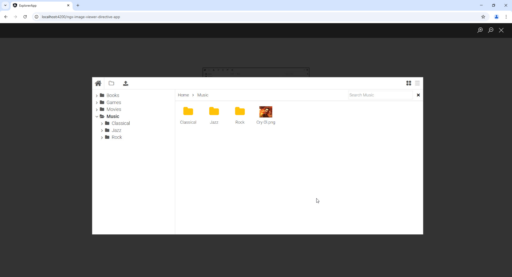

# ngx-image-viewer-directive

## Preview <a></a>

A basic image viewer based on Angular directives



## Quick Start <a></a>

-   Install package

```
yarn add ngx-image-viewer-directive
```
## Usage <a></a>
-   Add `ImageViewerModule` and data provider to `NgModule`
```Typescript
import { MainComponent } from './main/main.component';
import { ImageViewerModule } from 'ngx-image-viewer-directive';

@NgModule({
    imports: [
        ...
        ImageViewerModule
    ],
    exports: [],
    declarations:[MainComponent]
})
export class AppModule { }
```

-   Add `imageViewer` to `` tag in `.html` file

```html
 
```

### Supported events

| Events          | Description                           |
| :-------------- | :------------------------------------ |
| `Button`        | Zoom(in/out)/Close                    |
| `Mouse wheel`   | Zoom(in/out)                          |
| `Mouse click`   | Pan/Zoom(in/out)                      |
| `Touch`         | Pan/Refresh/Zoom (not supported yet)  |
| `Backdrop`      | Close                                 |
